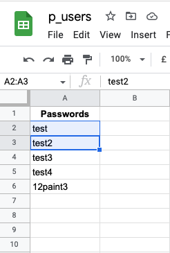

# PP3 - Python Hangman
(Developer: Maksims Buraks)

[live web-page](https://maksimb96.github.io/LoveBody/)

## Table of contents

1. [Project Goals](#project-goals)
    * [User Goals](#user-goals)
    * [Site Owner Goals](#site-owner-goals)
2. [User Experience](#user-experience)
    * [Target Audience](#target-audience)
    * [User Requirements and Expectations](#user-requirements-and-expectations)
    * [User Stories](#user-stories)
3. [Design](#design)
    * [Design](#design-choices)
    * [Structure](#structure)
    * [Flow Chart](#flow-chart)
4. [Tech Used](#tech-used)
    * [Languages](#languages)
    * [Tools](#tools)
5. [Features](#features)
6. [Code Validation & Testing](#validation)
7. [Bugs](#bugs)
8. [Deployment](#deploy)
9. [Future Features](#future-features)
10. [Credits](#credits)
11. [Acknowledgements](#acknowledgements)

## Project Goals

### User Goals
    -Finding a guess bassed game
    -To test guessing ability
    -To be able to return

### Site Owner Goals
    -Provide a simple and fun game 
    -Provide an area to login
    -Provide the option to restart

## User Experience

### Target Audience
    -People looking to test guess ability

### User Requirements and Expectations
    -A simple and intuative design
    -Quick inputs without complication
    -Clear visual markers on each turn
    -A way to restart

### User Stories

#### First-time User
1. As a first time user, I want to play hangman
2. As a first time user, I want to test my guessing skills
3. As a first time user, I want a simple and intuative interface
4. As a first time user, I want to have the option to restart

#### Returning User
5. As a returning user I want to login and play again
6. As a returning user I want to see diferent word sets
7. As a returning user I want to be able to play again

#### Site Owner
8. As a site owner I want people to be able to login and play
9. As a site owner I want people to be able create an account  
10. As a site owner I want people to either play again or not

## Design

### Design Choices
The game while being run in a terminal has some ascii art and terminal text colour in order to make it pop and be less monotone.

### Structure
The stucture while being relativly basic, is intuative. You are greeted with a login segment, the main game body and then a prompt to restart. If yes the loop begins again, if no, you are greeted with 'farewell' art and then retun to the login portion of hangman.

 

The game is made up of 3 stages:

    -Login: Tests if you aree new or an old user 
    -The main game body
    -Restart: If yes, then game loops if no, then return to login

### Flow Chart

Main Flow-Chart

-Blue is the login flow, red is the main game body, yellow are choices.

## Tech Used

### Languages
    -Python

### Tools
    -Git
    -Git Hub
    -Git Pod
    -Lucid-Chart
    -Heroku
    -Ascii art generator
    -random word generator
    -PEP8 CI Python Linter

## Features
The Game consists of 3 segments each with their own features

### Login
    -Greeted to hangman and option if you are either a old/new user 
    -If you are new, you enter details (password/username) that get written on spreeadsheet
    -If you are a old user, you enter existing information
    -If either username or password incorrect error will be thrown and login will begin again.
    -once details entered main title intro will play, that is slowed with sleep function
    -User Stories adressed: 3, 5, 8, 9
    

 

 

### Game Body
    -After title intro has played, users will be presented with the main game phase
    -Clear screen function focuses on the hangman game
    -Correct inputs show on empty guess word
    -Incorrect guesses provide feedback and increments the hangman
    -Inputs greater than one will throw error
    -If all lives exhausted leads to game over
    -If guess is correct, you win!
    -User stories adressed: 1, 2, 3, 6

### Restart
    -After loss or win you ar prompted with a restart
    -Checks against valid input
    -If yes, you restart game, if no you get a goodbye message and go back to login
    -User stories adressed: 4, 7, 10

## Validation

### PEP8 - CI Python Linter
PEP8 - CI Python Linter, was used in order to validate my code for my login.py code and run.py code. Rand-words and hangman-titles were not included as they
only focused on being called as art or to grab random words.

Game Body

Login

 

### Tests

#### Error Test:
    -Tested multitude of inputs for Login
    -Tested multitude of inputs for Game Body
    -Tested multitude of inputs for Restart

### Testing User Stories

1. As a first time user, I want to play hangman
2. As a first time user, I want to test my guessing skills
3. As a first time user, I want a simple and intuative interface
4. As a first time user, I want to have the option to restart
5. As a returning user I want to login and play again
6. As a returning user I want to see diferent word sets
7. As a returning user I want to be able to play again
8. As a site owner I want people to be able to login and play
9. As a site owner I want people to be able create an account  
10. As a site owner I want people to either play again or not

 

| **Feature** | **Action** | **Expected Results** | **Final Result** |
|-------------|------------|----------------------|------------------|
|             |            |                      |                  |
| Clear Hangman Display|Intuative display and correct/incorrect inputs|Correct errors and valid inputs producing correct result| Works as Intended|
|Login| Allows user to either log back in or set up username/password|Based on y or n you enter the game as old uer or new |Works as intended|
 
User Stories: 1, 2, 3, 5, 6, 8, 9
 

| **Feature** | **Action** | **Expected Results** | **Final Result** |
|-------------|------------|----------------------|------------------|
|             |            |                      |                  |
|Restart Prompt|User has y/n option| either restart or exit game back to login| Works as intended|
 
User Stories: 4, 7, 10
 

## Bugs

| **Bug** | **Fix** | 
|---------|---------|
|         |         | 
|Intial minor problem with whille loop logic| Issue turned out to be 'if lives < 0' which skipped main body of the game|
|Hangman art not displaying|Initially graphics were backwards, and implemented a for loop to cycle as incorrect inputs entered|
|Hidden Word not showing on correct guess| Similar to the while loop in game body, the argument in enumerate was set incorrectly|

## Deployment

Deployment of site was acheived through these steps:
1. I navigated to the settings section on git hub repositories on my repository.
2. I then selected the pages link on the left side.
3. I then selected source for the branch prompt.
4. Roughly, 2 minutes after refreshing I recieved a link to my site: https://maksimb96.github.io/LoveBody/ 

## Future Features

There are a few more feartures that I would like to implement in the future. These Include:
1.Implementation of pygame for a nicer interface
2.A score bar, that gets saved into spreadsheet that returns when existing user enters

## Credits
    
### Code 

1. Love sandwiches for providing knowledge on datasheet manipulation
2. Random word generator found at <a href ="https://randomwordgenerator.com/">on random word generator</a>
3. Colorama reccomended from masterclasses and manual used <a href = "https://pypi.org/project/colorama/">here</a>
4. Tutor support in helping my enumerate problem
5. Hangman inspiration from <a href = "https://www.youtube.com/watch?v=3_CX0aD9Fdg&t=272s">Youtube</a>
6. Hangman inspiration from <a href = "https://www.youtube.com/watch?v=pFvSb7cb_Us">Youtube</a>
7. Viktor my mentor for helping me identify and put me on the right track to fixing hangman not showing
8. gspread manual found <a href = "https://docs.gspread.org/en/latest/">here</a>
9. Arrow to string functionality  <a href = "https://pencilprogrammer.com/python-arrow-annotation/#:~:text=The%20%2D%3E%20(arrow)%20is,as%20documentation%20for%20the%20function." >here</a>
10. Hangman Art generator found <a href = "https://gist.github.com/chrishorton/8510732aa9a80a03c829b09f12e20d9c">here</a>
11. Python main = name found <a href = "https://www.youtube.com/watch?v=l3aRTwWanOE">here</a>
12. Hangman inspiration from <a href = "https://itsourcecode.com/free-projects/python-projects/hangman-game-in-python-with-source-code/#:~:text=A%20Hangman%20Game%20On%20Python,then%20the%20game%20is%20over.">here</a>

## Acknowledgements

-I would like to thank Victor my mentor or providing aamazing feedback!
 
-CI for provide me the knowledge to under-take this task specifically python module and love sandwiches
 
-Tutor Support for provideing better knowledge to implement the code and help me see minor errors
 
-My beautiful girlfriend who added literally one quetion mark
 
-The wonderful community over on Slack!

